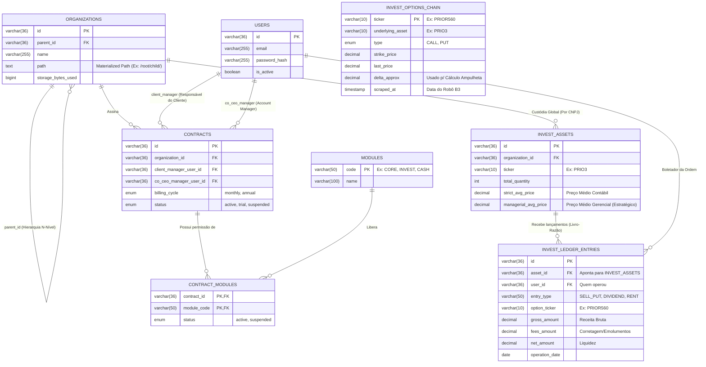

# Diagrama de Entidade-Relacionamento Lógico (DER Canônico)

Este documento representa o modelo de dados relacional canônico do CO-CEO. 
Abaixo está o DER lógico renderizado no padrão da indústria.

## Regras de Integridade Relacional (Triggers Lógicos)
1. **Multi-Tenant:** Toda consulta em `INVEST_ASSETS` ou `INVEST_LEDGER_ENTRIES` **deve obrigatoriamente** sofrer *join* com a tabela `ORGANIZATIONS` verificando o `path` do nó ativo.
2. **Cálculo de Preço Médio:** O campo `managerial_avg_price` na tabela `INVEST_ASSETS` não deve ser alterado manualmente. Ele é o resultado da divisão algébrica do estoque total pelo somatório dos `net_amount` na tabela `INVEST_LEDGER_ENTRIES`.
3. **Isolamento de Cache:** A tabela `INVEST_OPTIONS_CHAIN` é agnóstica de organização. O robô noturno popula ela globalmente para reduzir gargalos de processamento.
