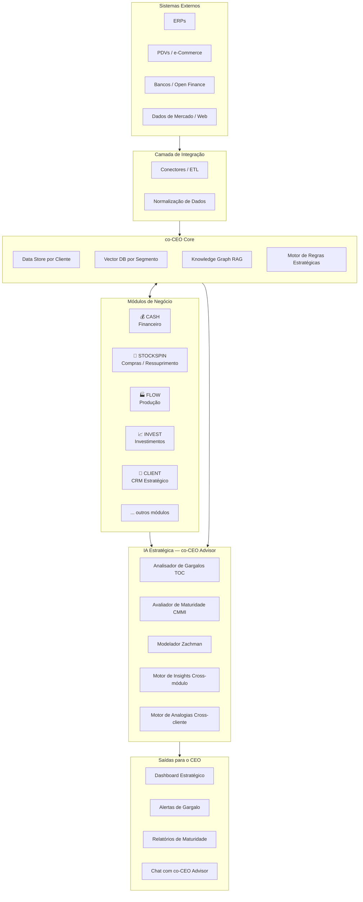
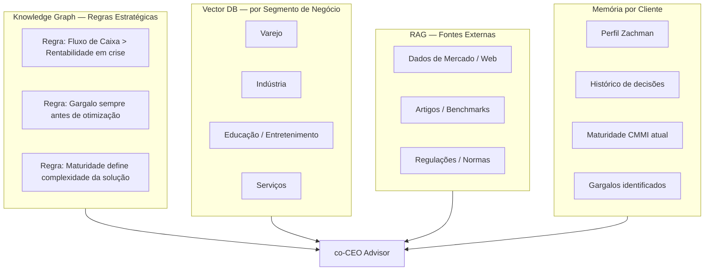

# co-CEO Platform — Modelagem Arquitetural

> **Status:** Rascunho v0.3 — enriquecido com apresentações comerciais e pitch decks FOCCUS  
> **Empresa:** FOCCUS Gestão  
> **Fundador:** Augusto Gomes (Mestre/Doutorando COPPE/UFRJ — ex-consultor Marinha Brasileira, Petrobras, NASA, TIM Itália)  
> **Cliente Piloto Atual:** SARON Cortinas (fábrica + 8-10 lojas de varejo + CD)  
> **Stack Atual:** Vite + Vanilla JS + Node.js/Express + MySQL + Socket.io + JWT  
> **Objetivo:** Modelar a visão, princípios e estrutura do sistema antes de qualquer reimplementação

---

## 1. Visão do Produto

O **co-CEO** é uma plataforma de inteligência estratégica para negócios que atua como um sistema guarda-chuva composto de módulos especializados. Sua diferencial central é uma **IA conselheira** que aprende com a operação de múltiplos clientes e segmentos, cruzando conhecimento de forma análoga à experiência acumulada de um consultor sênior.

> [!IMPORTANT]
> O co-CEO não é um ERP. É uma **camada de inteligência estratégica** que se conecta a ERPs, PDVs e outras fontes de dados, transformando dados operacionais em insights gerenciais e recomendações estratégicas.

### O que já existe (base real do projeto)

O projeto já tem um sistema funcional em produção para o cliente **SARON Cortinas**, estruturado como:
- **Algoritmo de Ressuprimento** (STOCKSPIN) — inteligência de supply chain com modelo matemático próprio ("Mira" + zonas orbitais)
- **Pipeline de dados** — ingestão do ERP legado via reconciliação estrita (sanitização de dados)
- **Frontend** — Vite + Vanilla JS com design system FOCCUS (Montserrat/Poppins, cores `#00425F`, `#DAB177`, `#202451`)
- **Backend** — Node.js + Express + MySQL + Socket.io (real-time) + JWT (auth)
- **Template base** (coceo_software_template) — estrutura multi-tenant com RBAC em 3 níveis já scaffolded
- **Documentação científica** — modelo matemático formal, Protocolo de Imutabilidade com Regras Estritas, análise TOC validada

---

## 2. Filosofia de Produto — O Eliminador de Planilhas

> [!IMPORTANT]
> O co-CEO **não é um ERP, não é um PDV e não quer ser**. Sua missão é **eliminar as planilhas paralelas** que as empresas criam porque seus ERPs são burocráticos demais para o dia a dia.

### 2.1 O Problema que Queremos Resolver

Empresas de pequeno e médio porte brasileiras têm baixo nível de maturidade em processos. ERPs existentes exigem que o usuário siga workflows completos (centros de custo, planos de contas, aprovações, conciliações) para realizar operações simples como dar entrada em um pagamento. O resultado é previsível:

```
ERP muito burocrático
    ↓
Funcionários abandonam o ERP para tarefas do dia a dia  
    ↓
Planilhas paralelas proliferam (Excel, Google Sheets)
    ↓
Dados ficam desconexos, desatualizados e sem análise
    ↓
Gestão baseada em "feeling" e não em dados reais
```

### 2.2 O Papel do co-CEO nesse Ecossistema

```
                    [ERP / PDV / Bancos]
                           ↓
                    [co-CEO — leitura]
                           ↓
          [Análises, alertas, listas de ação, dashboards]
                           ↓
              [CEO / Gerente / Operador — decisão]
```

O co-CEO **apenas lê** dos sistemas existentes (jamais escreve neles) e transforma dados brutos em **inteligência acionável** sem burocracia.

### 2.3 Contrato de UX — Anti-Burocracia

Este é o **contrato de design** que toda tela e todo módulo deve respeitar:

| Regra | O que isso significa na prática |
|---|---|
| **Zero campos obrigatórios desnecessários** | Se o dado já vem do ERP, não pede para o usuário digitar de novo |
| **Ação em 1 clique** | A sugestão da IA deve poder ser executada (ou registrada como "feita") em uma única ação |
| **Sem workflows de aprovação para operações simples** | Compliance é para grandes empresas; PMEs precisam de agilidade |
| **Lista do que fazer hoje** | Cada módulo entrega uma lista priorizada de ações para o dia, não um dashboard passivo |
| **Mobile-first** | O gerente de loja usa celular. A tela precisa funcionar sem teclado |
| **Dados do ERP são a fonte** | O co-CEO não concorre com o ERP; ele o **valoriza** ao extrair inteligência que o ERP não entrega |

### 2.4 O que o co-CEO Substitui

| O que elimina | Por quê existe hoje | O que entrega no lugar |
|---|---|---|
| Planilha de fluxo de caixa | ERP não tem visão projetada simples | CASH: fluxo projetado em tempo real |
| Planilha de controle de compras | ERP não gera sugestão inteligente | STOCKSPIN: lista de compras com Mira |
| Planilha de produtividade | ERP não prioriza por gargalo | FLOW: fila de produção por TPV |
| Relatório manual do CEO | Ninguém tem tempo de montar | IA conselheira: balanço estratégico diário |
| Planilha de clãs ABCXYZ | ERP não classifica dinamicamente | STOCKSPIN: curvas recalculadas todo dia |

### 2.5 Segmento-Alvo e Maturidade

O co-CEO é desenhado para empresas que estão nos **níveis 1-2 do CMMI** — onde os processos existem mas são informais ou reativos. Empresas nos níveis 4-5 já têm times de BI, compliance e governança e não são o alvo primário.

> [!TIP]
> A IA conselheira deve saber o nível de maturidade CMMI do cliente e **calibrar a complexidade das recomendações** de acordo. Não adianta sugerir um processo de S&OP completo para uma empresa que ainda não tem reunião mensal de resultados.

---

## 3. Princípios Teóricos Fundamentais

Estes frameworks não são apenas referências — eles **moldam as regras de inferência da IA** e a forma como o sistema classifica e prioriza problemas.

| Framework | Aplicação no co-CEO |
|---|---|
| **Teoria das Restrições (TOC)** | Identificação do gargalo sistêmico que limita o resultado financeiro da empresa como um todo. A IA nunca sugere otimização de um setor sem antes mapear se ele é o gargalo real. |
| **CMMI v1.2** | Maturidade das áreas de conhecimento da empresa. A IA usa o nível de maturidade para calibrar o tipo de recomendação (não sugere práticas de nível 4 para uma empresa em nível 1). |
| **Arquitetura Zachman** | Modelo de referência para entender a empresa em 6 perspectivas (Contexto → Detalhe) e 6 dimensões (O quê, Como, Onde, Quem, Quando, Por quê). Usado para estruturar o onboarding de cada cliente. |
| **Design Thinking** | Abordagem empática da IA para formular problemas antes de sugerir soluções. A IA "entrevista" os dados antes de concluir. |
| **Modelos Matemáticos** | Cadeia de Markov, Monte Carlo, otimização linear, análise de séries temporais para módulos como STOCKSPIN e FLOW. |

---

## 4. Arquitetura de Alto Nível



---

## 5. Arquitetura de Integração (Barramento e Modelo Canônico)

Para garantir que o **co-CEO** não fique engessado às particularidades de centenas de sistemas legados de clientes (ERPs, PDVs, sistemas de RH, etc.), a plataforma **NUNCA realizará integrações ponta a ponta (point-to-point)**.

A estratégia de ingestão de dados funcionará baseada em um **Barramento de Dados Simples (Event Bus)** combinado a um **Modelo de Dados Canônico (Ontologia)**:

1. **Raw Data Vault (Landing Zone):** Antes de qualquer transformação, o dado cru do cliente é salvo em um Data Lake/Storage imutável. Se a nossa regra de tradução falhar, podemos reprocessar o passado (Replayability).
2. **O Modelo Canônico:** A plataforma co-CEO define como o dado "ideal" deve ser estruturado para suas matemáticas.
3. **Conectores (Translators):** Um Worker lê o dado cru, mapeia e joga no Barramento (Event Bus).
4. **Desacoplamento Absoluto:** O Core consome do Barramento sem saber a origem.

Essa arquitetura garante **Agilidade de Onboarding** e protege os algoritmos proprietários (STOCKSPIN, CASH) das falhas estruturais de sistemas legados de terceiros.

---

## 6. Módulos — Visão Inicial

### 6.1 Módulos Definidos

| Módulo | Domínio | Status | Matemáticas Principais |
|---|---|---|---|
| **STOCKSPIN** | Compras e Ressuprimento | ✅ Em produção (SARON) | Mira (janela móvel robusta), Zonas Orbitais (8 níveis), Fourier, DBR |
| **CASH** | Financeiro | 🎯 MVP prioritário | Projeção de fluxo, análise de liquidez, risco de insolvência |
| **FLOW** | Produção (Fábrica) | 🔜 Parcialmente modelado | TOC/Drum-Buffer-Rope, OEE, priorização por Throughput de Valor |
| **INVEST** | Investimentos | 📋 Planejado | Markowitz, Sharpe, VaR, correlação de ativos |
| **CLIENT** | CRM Estratégico | 📋 Planejado | Segmentação RFM, previsão de churn, LTV probabilístico |

### 6.2 STOCKSPIN — Detalhe Técnico

A base do sistema de compras possui conceitos próprios documentados:

#### Modelo Matemático da Mira (formalizado em `docs/MODELO_MATEMATICO_MIRA.md`)

| Componente | Descrição |
|---|---|
| **Mira P100** | `M_t = μ_t × LT` — cobertura alvo diária via média robusta com janela móvel de 56 dias |
| **Winsorização** | Remove outliers superiores (p95) para não inflar a mira com eventos pontuais |
| **Filtro de ruptura** | Dias com `availableStock < 0` são excluídos da janela (demanda latente, não observada) |
| **Fallback** | Se < 5 dias limpos, usa todos os dias com winsorização |
| **Zonas orbitais** | 8 bandas multiplicativas sobre M_t: p10 (ruptura) → p800 (encalhado máximo) |

#### As 8 Zonas de Estoque (Parametrização de Giro)

| Zona | Intervalo | Cor | Ação |
|---|---|---|---|
| ⬛ RUPTURA | `avail < p10` | Preta | Compra emergencial |
| 🔴 CRÍTICO | `p10 ≤ avail < p50` | Vermelha | Compra urgente |
| 🟡 ABAIXO | `p50 ≤ avail < p100` | Amarela | Compra programada |
| 🟢 ACIMA | `p100 ≤ avail < p150` | Verde | OK |
| 🔵 MUITO ACIMA | `p150 ≤ avail < p200` | Azul | Reduzir compra |
| 🟣 ENCALHADO 1 | `p200 ≤ avail < p400` | Lilás | Logística reversa |
| 🟣 ENCALHADO 2 | `p400 ≤ avail < p800` | Roxa | Promoção / retorno |
| 🟣 ENCALHADO 3 | `avail ≥ p800` | Roxa escura | Liquidação |

#### Arquétipos de Demanda (base para IA)

- **Consumo** — reforço positivo (quanto mais vende, mais tende a vender) → ARIMAX + feedback
- **Bens Duráveis** — saturação de mercado → modelo de decrescimento pós-pico
- **Moda** — explosão + colapso → modelo Bass com cutoff de penetração
- **Sazonal Anual** — picos em datas fixas → séries de Fourier
- **Hard Deadlines** — "validade comercial" rígida (Páscoa, Natal) → buffer drenado agressivamente próximo ao evento
- **Sazonal intra-semanal** — oscilação dentro da semana (Cerveja, Carne)

### 6.3 Conceitos IP Únicos — Ativos Intelectuais da FOCCUS

Estes conceitos foram desenvolvidos e **validados empiricamente em campo** e são o núcleo diferenciador do co-CEO. Eles se tornarão **regras de inferência da IA conselheira** e sementes do Knowledge Graph.

#### IP de Supply Chain (STOCKSPIN)

| Conceito | Definição | Impacto Comprovado |
|---|---|---|
| **Disponibilidade Percebida (DP)** | `DP ≠ ruptura técnica`. Produto abaixo de 10% da Mira já perde vendas por invisibilidade cognitiva (eye-tracking: mínimo 3-4 unidades para registro cerebral) | DP de 60% → 96% (cooperativa ES) |
| **Ruptura Acumulada (RA)** | `RA = DP^n` onde n = itens do ticket. Com DP=65%, pedido de 10 itens = 1,35% de chance de atendimento completo | Eleva para 59,9% com DP=95% |
| **Ruptura Interna** | Produto disponível no CD/depósito mas ausente da gôndola/exposição. 30% das rupturas são internas. | Não aparece em nenhum relatório gerencial |
| **Estoque Vitrine** | `Disponível = MAX(0, Físico - Vitrine)`. Unidade em exposição não é vendável | Elimina rupturas mascaradas |
| **Throughput de Valor (TPV)** | Índice: `TPV = f(margem, giro, impacto na DP)`. Substitui custo unitário como critério | Usado no PCP da SARON |
| **Bullwhip Eliminado** | DBR conecta venda→loja→CD→fábrica→fornecedor via sinal puxado | Compra de tecidos derivada da demanda de loja |
| **Ciclo Destrutivo de Valor** | Encalhe → promoção → redução de margem → demais produtos encalham por comparação → ciclo amplia | 92% do capital em estoque não gira em < 1-2 anos |

#### IP de Gestão Estratégica (TOC Aplicada)

| Conceito | Definição | Regra para a IA |
|---|---|---|
| **Lucro por Minuto de Gargalo** | A decisão correta não é maximizar margem unitária, mas `Lucro_Total = (preco - cv) / min_gargalo`. Um produto "menos rentável" que usa menos gargalo pode gerar mais lucro total | *"Nunca priorize por margem unitária sem considerar o gargalo"* |
| **Rateio Perigoso** | Fechar uma unidade de negócio "deficitária" baseada em rateio de custos fixos pode REDUZIR o lucro total (ela contribuía com custos fixos compartilhados) | *"Nunca fechar unidades sem simular o impacto nos custos fixos restantes"* |
| **Paradoxo do Desconto** | Repassar desconto do fornecedor ao cliente com o mesmo markup percentual REDUZ o lucro absoluto | *"Desconto de fornecedor = opurtunidade de margem, não de repasse automático"* |
| **Lei de Brooks (Gestão)** | Contratar profissional barato para resolver atraso gera mais atraso (custo de gerenciamento + distância intelectual) | *"Capacidade não é headcount, é throughput efetivo"* |
| **Precificação pelo Mercado** | Preço não deve ser definido por custo+markup, mas pelo valor percebido pelo cliente. Custos determinam viabilidade, não preço | *"Preço é uma decisão de mercado, não contábil"* |

#### Cases Validados em Campo

| Cliente | Segmento | Resultado |
|---|---|---|
| **Nater Coop** | Cooperativa agrícola (22 lojas, 1 CD, 13.000 SKUs) | Ruptura: 35% → 1,8% \| Estoque: -30% \| R$ 15M de capital de giro liberado |
| **SARON Cortinas** | Fábrica + 10 lojas varejo | PCP integrado a compra de insumos via demanda puxada \| Ruptura acumulada resolvida |
| **Padaria (anônima)** | Alimentos | Resultado: -R$80K/mês → +R$60K/mês em 2 meses de projeto |
| **Cacau Show, Argos, Julia Torquetti** | Varejo | Implementação do modelo de Disponibilidade Percebida |

### 6.4 Arquétipos de Demanda (base para IA)

Cada arquétipo tem **política de buffer distinta** e **modelo matemático específico**:

| Arquétipo | Comportamento | Modelo | Risco Principal |
|---|---|---|---|
| **Consumo** | Quanto mais vende, mais tende a vender (reforço positivo) | ARIMAX + feedback | Sub-compra |
| **Bens Duráveis** | Quanto mais vende, menos mercado sobra (saturação) | Decrescimento pós-pico | Super-compra |
| **Moda** | Explosão exponencial + colapso abrupto | Bass com cutoff de penetração | Não detectar o colapso |
| **Sazonal Anual** | Picos em datas fixas (Picolé no verão, Cobertor no inverno) | Séries de Fourier | Compra fora de janela |
| **Hard Deadline** | "Validade comercial" rígida (Páscoa, Natal) | Buffer drenado agressivamente | Sobra pós-evento |
| **Sazonal Intra-semanal** | Oscilações dentro da semana (Cerveja, Carne) | Séries de Fourier semanais | Ruptura de final de semana |

### 6.5 Princípio de Expansão de Módulos

Novos módulos devem seguir um **contrato padrão** que permite à IA conselheira integrá-los automaticamente:

1. **Publicar suas métricas-chave** (KPIs exportáveis)
2. **Declarar suas dependências** (quais outros módulos afetam ou são afetados)
3. **Registrar seus gargalos potenciais** (quais pontos podem ser restrições sistêmicas)
4. **Expor uma API de perguntas estratégicas** (quais perguntas o módulo pode responder sobre o negócio)

---

## 7. A IA Conselheira — Arquitetura de Inteligência

Esta é a peça mais diferenciadora do sistema.

### 7.1 Camadas de Inteligência

```mermaid
graph LR
    subgraph L1["L1 — Inteligência Operacional"]
        OP1[Alertas de anomalia por módulo]
        OP2[KPIs fora de faixa]
        OP3[Previsões de curto prazo]
    end

    subgraph L2["L2 — Inteligência Tática"]
        T1[Correlações entre módulos]
        T2[Identificação de gargalo TOC]
        T3[Gap de maturidade CMMI]
    end

    subgraph L3["L3 — Inteligência Estratégica"]
        S1[Visão Zachman do negócio]
        S2[Recomendações de portfólio]
        S3[Analogias cross-cliente]
        S4[Tendências de mercado]
    end

    L1 --> L2 --> L3
```



### 7.2 Motor de Aprendizado Cross-Cliente

> [!NOTE]
### 7.1 A Evolução Profunda da IVA (IA Conselheira)
*(Inspirada nas experimentações da antiga EVA v0.8.xx do CASH)*

Diferente de um assistente de suporte técnico ou um chatbot comum, a **IVA** não se limita a uma tela de chat ou comandos de voz. Ela é o **cérebro assíncrono** do co-CEO.

A nova IVA deve ser projetada para atuar em múltiplas frentes, muitas vezes de forma **invisível (background)**:
1. **Inteligência Proativa e Silenciosa:** Varrendo e cruzando dados continuamente através de *todos* os módulos comprados pelo cliente (ex: ligando ruptura de estoque no STOCKSPIN com falta de liquidez no CASH).
2. **Geração de Relatórios Consolidados:** Em vez de esperar uma pergunta, a IVA pode montar ativamente um dossiê executivo com base em modelos matemáticos (TOC) e entregar as prioridades do dia para o gestor.
3. **Interface Adaptável:** A interação humana (seja via Chat, Modais, Voz ou apenas uma dashboard gerada dinamicamente) é apenas *uma* das formas pelas quais a inteligência da IVA é consumida, não a sua definição estrutural.

### 7.2 O Que Aproveitamos da Versão Legada (V0.8)
Embora a nova IVA vá muito além, os conceitos legados servem de base sobre **como tratar a interação direta** (quando ela for necessária):
- **Ação Direta (`Operate` vs `Chat`):** Quando interagindo via interface, a IVA tem a capacidade de atuar na tela do usuário.
- **Curadoria de Intenção:** Um crivo antes do LLM.
- **Adaptação de Persona:** O nível de profundidade e o tom do insight variam se quem está lendo o relatório gerado é o dono (estratégico), um consultor (risco), ou um analista (tático).

**Exemplo de ciclo de aprendizado (Com Human-in-the-loop):**

1. Cliente A passa por crise de caixa após crescimento rápido de estoque.
2. A IA sugere uma **hipótese de regra estratégica**: *"Priorizar liquidez sobre margem em crescimento > 15%"*.
3. **Curadoria (Gargalo de Segurança):** A regra NÃO vai direto para o cliente B. Um consultor interno do co-CEO revisa a regra, garante que nenhum dado sensível do Cliente A vazou no prompt, e a aprova.
4. A regra é comitada no Knowledge Graph Global e aplicada a todos os clientes do segmento.

### 7.3 Estrutura do Conhecimento (RAG + Vector DB + Knowledge Graph)



---

## 8. Onboarding de um Novo Cliente — Fluxo Zachman

O processo de entender um novo cliente segue as 6 perspectivas do Zachman:

| Perspectiva | Perguntas que o sistema faz | Onde os dados vão |
|---|---|---|
| **Contextual (Executivo)** | Qual o negócio? Qual a visão? Quais os objetivos estratégicos? | Perfil do cliente no Knowledge Graph |
| **Conceitual (Gestor de Negócio)** | Qual o portfólio de produtos/serviços? Quem são os clientes? | Vector DB do segmento |
| **Lógica (Arquiteto)** | Como os processos funcionam? Quais são os fluxos de valor? | Modelo de processo do cliente |
| **Física (Tecnólogo)** | Quais sistemas existem? Onde estão os dados? | Mapa de conectores e integrações |
| **Detalhada (Desenvolvedor)** | Como os dados estão estruturados? Quais os campos disponíveis? | Schema do Data Store do cliente |
| **Funcionamento (Usuário)** | Quem usa o sistema? Quais decisões eles tomam? | Perfis de usuário e permissões |

---

## 9. Stack Técnica Atual e Roadmap

### 9.1 Stack Atual (herdada do projeto D:\co_ceo)

| Camada | Tecnologia | Observação |
|---|---|---|
| Frontend | Vite + Vanilla JS (ES6+) | Template `coceo_software_template` já scaffolded |
| Estilo | CSS3 com variáveis customizadas | Design system FOCCUS (Montserrat/Poppins) |
| Backend | Node.js + Express | Servidor em port 3001 |
| Real-time | SSE (Server-Sent Events) | Substitui Socket.io para maior escalabilidade horizontal (stateless), mantendo WebSocket apenas se bidirecional for vital |
| Auth | JWT | Multi-tenant por tenant_id |
| Banco | MySQL 8+ | Schema `co_ceo_db` com migrations em `sql/ceo/` |
| Legado | Conexão de leitura ao ERP da SARON | Protocolo de imutabilidade — nunca escreve no legado |

### 9.2 Princípios de Ingestão de Dados (Imutabilidade)

> [!CAUTION]
> Estas regras foram estabelecidas com sangue: violações causaram dados fantasmagóricos e divergências de estoque.

1. **Auditoria Absoluta (v7)** — nunca confiar no dado espelhado do ERP sem passar pelo pipeline de reconciliação
2. **Imutabilidade do Legado** — o sistema novo apenas lê o legado, nunca escreve
3. **Deduplicação Absoluta** — `doc_origem` garante que venda e execução não se somem
4. **Marco Zero (Lift)** — estoque histórico nunca pode ser "fantasmagórico" (< 0); lift corrige o mínimo histórico para 0
5. **Arquitetura Dual** — sempre separar Estoque Físico (Capital/ROI) do Estoque Disponível (Comando de Reposição)

### 9.3 Modelo de Negócio do co-CEO (B2B SaaS)

```
co-CEO Core (obrigatório) — Auth + IAM + RBAC + IA Estratégica
├── + STOCKSPIN     → Compras / Ressuprimento  [EM PRODUÇÃO]
├── + CASH          → Financeiro               [MVP PRIORITÁRIO]
├── + FLOW          → Produção                 [MODELADO]
├── + INVEST        → Investimentos            [PLANEJADO]
└── + CLIENT        → CRM Estratégico          [PLANEJADO]

Pacotes sugeridos:
├── Pacote Varejo    → CASH + STOCKSPIN + CLIENT
├── Pacote Indústria → CASH + STOCKSPIN + FLOW
└── Pacote Completo  → Todos os módulos
```

### 9.4 Gestão de Identidade e Impersonation (Super Admin)

Um requisito crítico para a equipe interna de desenvolvimento e suporte do co-CEO é a capacidade de **Emulação (Impersonation)**.
- **Painel de Controle Central:** A equipe interna usará uma interface de "Super Usuário" para gerenciar permissões.
- **Sessão Emulada:** Sem precisar sair do sistema ou pedir senhas, um Super Usuário poderá "incorporar" (emulate/impersonate) qualquer usuário de qualquer projeto.
- **Contexto Preservado:** A arquitetura de autenticação (JWT) deverá suportar *tokens de impersonation* (ex: `emulated_by: admin_id`). Isso permite abrir o projeto do cliente em uma nova aba do navegador e enxergar exatamente a visão daquele cliente, mantendo total transparência e rastreabilidade absoluta de que foi a equipe de suporte atuando.

### 9.5 Sistema Global de Auditoria de Dados (100% Log)

O co-CEO não é apenas um sistema de gestão, é uma ferramenta de compliance. O sistema terá um **Audit Trail Estrito**:
- **O que mudou (Before/After):** O log grava o delta exato da alteração (ex: `{ campo: "valor", de: 1000, para: 1200 }`).
- **Rastreabilidade de Impersonation:** Se a equipe de suporte estiver emulando o João, o log registrará: `Action by: João (Emulado por Admin: Carlos)`.
- **Arquitetura Wrapper (Data Access Layer - DAL):** O acesso direto ao banco de dados será abolido para lógicas de negócio. Em vez de Triggers (que são difíceis de manter e debugar), existirá um "Muro de Proteção" (Wrapper/API de Dados) em volta do banco. Nenhum frontend, módulo ou script de desenvolvedor poderá alterar tabelas diretamente no MySQL. Tudo precisará chamar o Wrapper.
- **Responsabilidade do Wrapper:** É esta camada centralizada que garante a validação do JWT, aplica as regras de negócio, checa permissões e, inevitavelmente, **gera o log de auditoria** de forma automatizada e padronizada, impedindo que desenvolvedores burlem as regras acidentalmente por desconhecimento.

### 9.6 Anatomia Atual do App CASH (Base para Migração)

A análise do repositório `cash-app` revelou uma base sólida que será refatorada/migrada para o co-CEO. As características técnicas atuais incluem:

1. **Estrutura de Banco de Dados (MySQL)**
   - **Auth/Multi-tenant Base:** `projects`, `users`, `project_users`. Esta é a semente do **co-CEO Core**.
   - **Entidades Centrais:** `empresas`, `contas`.
   - **Árvores de Categoria:** `tipo_entrada`, `tipo_saida`, `tipo_producao_revenda` (permite plano de contas flexível).
   - **Transacionais:** `entradas`, `saidas`, `producao_revenda`, `aportes`, `retiradas`, `transferencias`. Todas vinculadas ao contexto multi-tenant (`project_id`, `company_id`).

2. **Backend (Node.js/Express)**
   - Controladores e Rotas modularizados por entidade de negócio (`accounts`, `incomes`, `saidas`, `marketing`, `userManagement`).
   - Evidência forte de experimentação inicial com IA e Vetores, notável pela presença de scripts de migração para o **Qdrant** (Vector DB).

3. **Frontend (Vite + Vanilla JS)**
   - Arquitetura baseada em Componentes JS puros (`AccountManager`, `IncomeManager`, `CampanhaWizard`).
   - Forte uso de Modais para as operações de CRUD, alinhado à filosofia de "ação em 1 clique" e operações sem recarregar a tela.
   - Elementos reaproveitáveis complexos como `SharedTable` (grids de dados) e `GenericTreeManager` (gestão hierárquica do plano de contas).

### 9.7 Valor que Aumenta com o Tempo (Network Effect)

> [!TIP]
> Quanto mais clientes no sistema, mais rico o Knowledge Graph fica. Isso cria um efeito de rede onde clientes que entram depois têm acesso a uma IA mais experiente — um diferencial que concorrentes não conseguem replicar rapidamente.

---

## 10. Políticas de Resiliência e Segurança Enterprise

Para garantir a robustez e compliance do sistema frente a falhas estruturais, vazamento de dados e sobrecarga operacional, as seguintes políticas são dogmas inegociáveis do co-CEO Core:

### 10.1 Isolamento de Tenant Hierárquico (Franquias e Zero Data Leakage)
- O modelo Multi-Tenant será **Hierárquico**. Isso permite suportar Redes de Franquias nativamente: um usuário "Franqueador" pode ter visão global de todas as "Empresas/Lojas" filhas, enquanto um usuário "Franqueado" fica isolado apenas na sua loja, sem alterar a estrutura do sistema.
- O filtro de tenant (`tenant_id` e `company_id`) **não será delegado à aplicação no nível das queries**.
- O Wrapper injetará o contexto do tenant diretamente na sessão do banco de dados (ex: via `SESSION VARIABLES` do MySQL) ou garantirá isso via Views de segurança. Se um script tentar fazer um `SELECT * FROM entradas`, o banco só retornará os dados pertinentes ao nível hierárquico daquele usuário, impossibilitando o vazamento cruzado.

### 10.2 Proteção contra Noisy Neighbor (Rate Limiting)
- O acesso ao Wrapper será protegido por um **API Gateway** com regras estritas de *Throttling* baseadas no plano do cliente.
- Se a requisição exceder o uso justo de CPU/Conexão do banco, a requisição será enfileirada ou rejeitada com `HTTP 429 Too Many Requests`, protegendo os clientes menores das operações de carga pesada de clientes corporativos.

### 10.3 Message Broker para Cargas Pesadas (IA e Relatórios)
- O Event Loop do Node.js jamais será bloqueado esperando chamadas HTTP externas demoradas (ex: API da OpenAI para a IVA).
- Todo processamento pesado e interação com LLMs será offloaded para um **Message Broker (Ex: Redis Pub/Sub, RabbitMQ)**. O frontend recebe um `202 Accepted` e o resultado real é injetado na tela via **WebSocket**, prevenindo timeouts de gateway e garantindo escalabilidade horizontal.

### 10.4 Retenção de Dados e Soft Deletion Global
- O comando `DELETE` físico será banido das tabelas contendo regras de negócio e transações.
- O Wrapper converterá exclusões em **Soft Deletes** (`deleted_at`), garantindo a integridade temporal para a IVA e mantendo o Audit Trail intacto. Rotinas assíncronas isoladas farão o expurgo (Hard Delete) dos dados apenas após os prazos de conformidade da LGPD expirarem (ex: 5 anos).

### 10.5 Feature Toggles (Dark Launches)
- Nenhuma feature grande (ex: um novo módulo de investimentos) será lançada com *hard-deployment*. 
- A plataforma utilizará um sistema de **Feature Flags** gerido pelo Super Admin, permitindo liberar módulos silenciosamente apenas para clientes piloto específicos em ambiente de produção, sem afetar o resto da base instalada.

### 10.6 Idempotência Obrigatória (Proteção contra Duplicação)
- Em sistemas distribuídos, conectores e redes falham. Se um conector reenviar um evento de "Venda" por instabilidade de rede, o sistema não pode duplicar a receita.
- O Wrapper exigirá uma chave de idempotência (`Idempotency-Key` ou um hash único do evento de origem) em todas as rotas de mutação, garantindo que `f(x) = f(f(x))`.

---

## 11. Próximos Passos (To-Do List Arquitetural)

### 11.1 Estabelecer a Ontologia e o Barramento
- [ ] Definir o schema inicial do Modelo Canônico (quais os nomes e tipos oficiais das nossas entidades).
- [ ] Escolher a tecnologia do barramento leve (ex: RabbitMQ, Redis Streams, Kafka ou apenas tabelas de stage no MySQL inicial?).

### 11.2 Refatoração do Core
- [ ] Limpar o template base (`coceo_software_template`).
- [ ] O RBAC de 3 níveis (módulo, ação, campo) do template é suficiente ou precisa de evolução?
- [ ] Como lidar com a **Landing Zone** (dados brutos auditáveis em MySQL) no novo sistema? Manter a abordagem atual?

### 11.3 Sobre o CASH (MVP Prioritário)
- [x] O repositório `cash-app` foi analisado em profundidade. Ele fornece a base de dados (MySQL multi-tenant com `projects`, `users`, `empresas`, `contas` e entidades de transação financeira como `entradas`, `saidas`, `transferencias`, `aportes`) e uma estrutura modular no frontend (Vanilla JS + Vite) e backend (Express).
- [ ] O CASH atual possui um módulo de "Campanhas" (marketing/dispatch). Na nova arquitetura co-CEO, isso fará parte de um módulo separado (ex: CLIENT/Marketing) ou continuará atrelado ao financeiro?
- [ ] A integração bancária (Open Finance) ou conciliação (OFX) será um dos focos iniciais na nova versão do CASH?

### 11.4 Sobre as Integrações
- [ ] Além da SARON (ERP legado), quais outros conectores são prioritários? (TOTVS, Omie, Bling?)
- [ ] Haverá conector genérico via planilha/CSV para clientes sem ERP? (muito útil para PMEs)
- [ ] O pipeline diário atual (scripts PowerShell + Node.js) será mantido ou migrado?

### 11.5 Sobre o Cliente de Educação/Entretenimento
- [ ] Quais módulos esse cliente precisaria? (CLIENT + CASH + algum específico de educação?)
- [ ] Qual o modelo de negócio deles? (mensalidades, eventos, produtos físicos?)
- [ ] Esse cliente seria o segundo piloto, depois de consolidar o CASH?

### 11.6 Sobre a Hospedagem e Deploy
- [ ] Atualmente o sistema roda **on-premise** (scripts PowerShell agendados, sincronização local). Vai para cloud?
- [ ] Se cloud: AWS, Azure ou GCP? Ou manter flexível?
- [ ] Multi-tenant compartilhado ou instância por cliente?

### 11.7 IAM, Cockpit e controle de acesso
- [x] Modelo normativo: [cockpit_iam_model.md](./cockpit_iam_model.md)
- [x] Schema IAM (`03_iam_cockpit_schema.sql`) + catálogo de permissões (`005_permissions_and_roles.sql`)
- [x] API base: `/api/auth/*`, `/api/cockpit/platform/*`, `/api/cockpit/me/*`
- [ ] UI Cockpit (Vite) — árvore de clientes, equipe, papéis, impersonation em nova aba

### 11.8 Qualidade e regressão (documentado — implementação na fase do Core)
- [x] Política normativa de testes por localização da alteração, reteste completo e geração assistida: [regression_testing_policy.md](./regression_testing_policy.md)
- [x] Resumo executivo e pirâmide: [testing_strategy.md](./testing_strategy.md)
- [ ] Implementar `tests/impact-map.yml`, scripts `test:impact` / `test:full` e pipeline de CI (após `CoCeoDataGateway` unificado)

### 11.9 Roadmap Geral
1. **Ver o código do CASH no git** — entender o que já existe
2. **Definir o schema de dados do CASH** — quais tabelas e campos mínimos
3. **Estruturar o co-CEO Core / IAM** — Base Multi-Tenant e RBAC + base do módulo de controle de acesso
4. **Integrar STOCKSPIN existente** ao novo Core (migração, não reescrita)
5. **Definir o contrato padrão de módulo** — interface que permite à IA conectar qualquer módulo
6. **Planejar a camada de IA** — quando o Core estiver sólido
